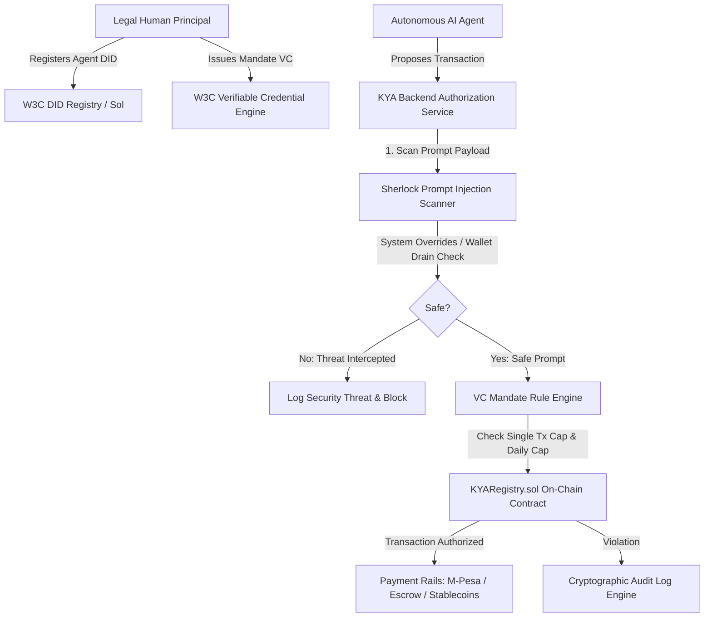

# KYA (Know Your Agent) Architecture & Technical Specification

> **Decentralized Identity, Authorization & Prompt Injection Defense Infrastructure Layer for Autonomous Financial AI Agents**

---

## Overview Architecture

The **Know Your Agent (KYA)** platform establishes a multi-layered trust model for autonomous AI agents performing high-value financial actions.

---

## Core Components

### 1. W3C DID Registry (`did:kya:solana:...`)
- Generates Ed25519 key pairs and JSON-LD standard W3C DID Documents.
- Binds autonomous agent public keys to legal human principal wallets/addresses.

### 2. Verifiable Credentials Mandate Engine (`AgentMandateCredential`)
- Encapsulates single-transaction caps (`spendingLimitPerTx`), daily caps (`dailySpendingCap`), and merchant category whitelists.
- Cryptographically signed with Ed25519 signatures (`Ed25519Signature2020`).

### 3. Sherlock Real-Time Prompt Injection Scanner
- Scans natural language instructions for system override keywords (`ignore previous instructions`), wallet drain phrases (`transfer all funds`), and split-transaction cap evasion tactics.
- Outputs threat score (0 to 100) and severity rating (`CRITICAL`, `HIGH`, `MEDIUM`, `LOW`).

### 4. Smart Contract Security Anchor (`KYARegistry.sol`)
- Solidity smart contract deployed on EVM/Solana networks.
- Enforces stateful verification for transaction compliance before on-chain execution.
